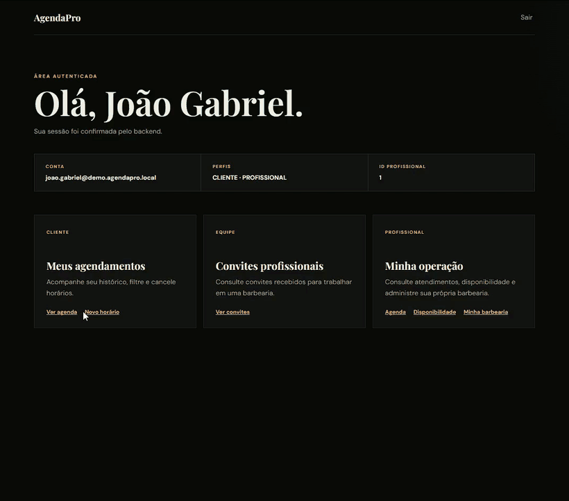

# AgendaPro API

[](https://github.com/msampaio-dev/AgendaPro/actions/workflows/backend-ci.yml)
[](https://openjdk.org/projects/jdk/21/)
[](https://spring.io/projects/spring-boot)
[](LICENSE)



API de agendamento para barbearias, em Java 21 e Spring Boot. Cada barbearia tem equipe, catálogo e horário de funcionamento próprios, e o cliente escolhe onde e com quem quer ser atendido. Duas reservas para o mesmo horário nunca são aceitas juntas, nem quando chegam no mesmo instante, porque o próprio banco recusa a segunda.

> Teste o produto em [agenda-pro-web-agendapro2.vercel.app](https://agenda-pro-web-agendapro2.vercel.app/). O código do frontend está em [msampaio-dev/AgendaPro-Web](https://github.com/msampaio-dev/AgendaPro-Web).

## Destaques

- Nenhum horário é reservado duas vezes, mesmo quando duas pessoas clicam no mesmo instante. A aplicação verifica antes, e o PostgreSQL recusa a sobreposição se as duas reservas passarem juntas.
- Os horários livres levam em conta a jornada do profissional, o funcionamento da unidade, o almoço, os bloqueios, os horários extras e as reservas que já existem.
- Cada barbearia tem os próprios profissionais, serviços, preços, equipe e histórico.
- Os horários locais usam `LocalDate` e `LocalTime`, e as reservas são gravadas como `Instant`, com o `ZoneId` de cada profissional.
- Cliente, profissional, proprietário da barbearia e administrador têm permissões diferentes.
- O Hibernate só valida o schema. Toda mudança no banco passa pelo Flyway.
- Os testes de integração rodam num PostgreSQL descartável, com Testcontainers, e nunca tocam o banco local.

## O produto

O cliente escolhe a barbearia, o profissional e o serviço (com barba como adicional) e vê apenas horários livres. O profissional cuida da própria agenda, da jornada, do almoço e dos bloqueios. Já o proprietário administra a unidade, a equipe e o catálogo, com preços próprios, e o administrador acompanha a plataforma inteira.

A lista completa de funcionalidades e as telas de cada perfil estão no [README do frontend](https://github.com/msampaio-dev/AgendaPro-Web#experiência-por-perfil).

## A regra mais importante

Um profissional nunca pode ter dois agendamentos que ocupem o mesmo intervalo.

```text
Reserva existente:  14:00 ───────── 14:30
Nova tentativa:            14:15 ───────── 14:45  → rejeitada
Intervalo adjacente:                     14:30 ─── 15:00  → permitido
```

A proteção acontece em duas camadas:

1. o service verifica previamente se existe sobreposição;
2. o PostgreSQL aplica uma exclusion constraint sobre `tstzrange`.

Um teste de concorrência com PostgreSQL real dispara duas requisições praticamente ao mesmo tempo e confirma que só uma consegue reservar o intervalo.

## Arquitetura

O AgendaPro é um monólito modular, organizado por funcionalidade.

```text
com.agendapro
├── auth
├── usuario
├── profissional
├── barbearia
├── profissionalservico
├── servico
├── disponibilidade
├── agendamento
├── security
└── shared
```

```text
HTTP/JSON
   │
   ▼
Controller ── DTOs + validação
   │
   ▼
Service ───── regras de negócio + transações
   │
   ▼
Repository ── Spring Data JPA
   │
   ▼
PostgreSQL ── constraints + integridade + concorrência
```

Os controllers cuidam do contrato HTTP, os services coordenam casos de uso e transações, as entidades protegem o próprio ciclo de vida e os repositories isolam a persistência.

## Decisões técnicas

| Decisão | Por quê |
|---|---|
| Monólito modular | Um único deploy, com cada funcionalidade no seu pacote. Dividir em microsserviços só compensaria com várias equipes ou partes que precisem escalar separadas. |
| DTOs na entrada e na saída | A API conversa com o cliente por contratos próprios. Mudar uma tabela não quebra quem consome. |
| `ddl-auto=validate` | O Hibernate só confere o banco, nunca altera. O schema muda apenas por migration. |
| Flyway | Todo ambiente chega ao mesmo banco pelo mesmo caminho, e cada mudança fica versionada como código. |
| JWT stateless | O servidor não guarda sessão: o frontend envia o token a cada requisição, sem depender de cookie. |
| BCrypt | É lento de propósito. Mesmo que o banco vaze, descobrir as senhas por tentativa fica caro demais. |
| `Instant` no banco | Guarda o momento exato, sem ambiguidade de fuso. O horário local é calculado com o fuso de cada profissional. |
| Constraint de exclusão | O próprio PostgreSQL recusa dois horários sobrepostos, mesmo que a aplicação falhe. |
| Testcontainers | A regra mais importante depende de recursos exclusivos do PostgreSQL. Testar num banco em memória não provaria que ela funciona. |
| Desativação lógica | Registros são desativados, não apagados: o histórico de agendamentos continua íntegro. |

## Stack

- Java 21
- Spring Boot 3.5
- Spring Web, Validation e Data JPA
- Spring Security e JWT
- PostgreSQL e Flyway
- JUnit 5, Mockito e Testcontainers
- Swagger/OpenAPI
- Maven Wrapper
- Docker e Docker Compose
- GitHub Actions

## Executando localmente

### Pré-requisitos

- JDK 21;
- PostgreSQL;
- Docker Desktop para os testes de integração.

Crie o banco `agendapro` e o usuário `agendapro_user`. Depois configure:

| Variável | Uso |
|---|---|
| `DB_PASSWORD` | Senha do PostgreSQL local |
| `JWT_SECRET` | Chave Base64 com pelo menos 32 bytes |

Para gerar uma chave de desenvolvimento no PowerShell:

```powershell
$bytes = New-Object byte[] 32
[Security.Cryptography.RandomNumberGenerator]::Fill($bytes)
[Convert]::ToBase64String($bytes)
```

Inicie a API:

```powershell
.\mvnw.cmd spring-boot:run
```

O perfil padrão é `dev`, com PostgreSQL em `localhost:5432`. A API estará em `http://localhost:8080/api/v1`.

### Docker Compose

```powershell
Copy-Item .env.example .env
docker compose up --build
```

Preencha `DB_PASSWORD` e `JWT_SECRET` no `.env`. O arquivo é ignorado pelo Git e não deve ser versionado.

Para encerrar sem apagar os dados:

```powershell
docker compose down
```

## Documentação da API

Com o projeto local em execução:

- Swagger UI: [http://localhost:8080/swagger-ui.html](http://localhost:8080/swagger-ui.html)
- OpenAPI JSON: [http://localhost:8080/v3/api-docs](http://localhost:8080/v3/api-docs)
- Health check: [http://localhost:8080/actuator/health](http://localhost:8080/actuator/health)

Principais grupos de endpoints:

| Recurso | Exemplos |
|---|---|
| Autenticação | `POST /auth/login`, `GET /auth/me` |
| Usuários | cadastro, atualização, desativação e reativação |
| Barbearias | gestão da unidade, proprietário, equipe, foto e funcionamento |
| Serviços | catálogo por barbearia e associação com profissionais |
| Disponibilidade | jornada, almoço, bloqueios, horários extras e consulta de vagas |
| Agendamentos | criação, filtros, confirmação, cancelamento e conclusão |

Todos os endpoints usam o prefixo `/api/v1`.

## Testes e qualidade

```powershell
.\mvnw.cmd verify
```

Na última verificação local, os 164 testes passaram. A suíte inclui:

- testes unitários de services e entidades;
- Mockito para colaboradores isolados;
- testes HTTP de autenticação, validação, CORS e autorização;
- migrations Flyway aplicadas do zero;
- PostgreSQL real com Testcontainers;
- teste de concorrência para reservas simultâneas;
- persistência e validação de imagens;
- bootstrap seguro do primeiro administrador.

O GitHub Actions executa `mvn verify` com Java 21 em todo push e pull request para `main`.

## Segurança

- senhas armazenadas exclusivamente com BCrypt;
- JWT assinado, com emissor e expiração validados;
- autorização por perfil, proprietário e titular do recurso;
- mensagens de login que não revelam se um e-mail existe;
- CORS restrito às origens configuradas;
- segredos fornecidos por variáveis de ambiente;
- bootstrap administrativo opcional e de uso único;
- upload limitado a JPEG/PNG, com tamanho e conteúdo validados;
- container executado com usuário sem privilégios administrativos.

### Primeiro administrador

Não existe endpoint público para transformar uma conta em `ADMIN`. O primeiro administrador é criado por bootstrap controlado por ambiente:

```powershell
$env:BOOTSTRAP_ADMIN_ENABLED="true"
$env:BOOTSTRAP_ADMIN_NAME="Administrador"
$env:BOOTSTRAP_ADMIN_EMAIL="admin@agendapro.com"
$env:BOOTSTRAP_ADMIN_PASSWORD="defina-uma-senha-forte"
.\mvnw.cmd spring-boot:run
```

Depois da criação, desative `BOOTSTRAP_ADMIN_ENABLED` e remova as variáveis sensíveis.

## Banco e migrations

As migrations ficam em `src/main/resources/db/migration`. O Hibernate está configurado com `ddl-auto=validate`: ele verifica a compatibilidade das entidades, mas não cria nem modifica tabelas.

Uma migration já aplicada não deve ser editada. Toda evolução de schema recebe uma nova versão, preservando ambientes existentes e o histórico do banco.

## Demonstração online

O frontend está publicado na Vercel e a API em infraestrutura gratuita. Quando o backend está hibernando, a primeira requisição pode levar até cerca de um minuto enquanto o serviço sobe, e a tela de login avisa que isso está acontecendo.

A conta demonstrativa exibida na tela de login permite explorar também os fluxos do profissional. Os dados desse ambiente são fictícios e compartilhados; credenciais administrativas não são publicadas.

A demonstração está em [https://agenda-pro-web-agendapro2.vercel.app](https://agenda-pro-web-agendapro2.vercel.app/).

## Limitações conhecidas

- O plano gratuito hiberna o serviço depois de cerca de quinze minutos sem tráfego, e acordar leva até um minuto. A aplicação aquece o caminho crítico assim que sobe e o frontend avisa quem está esperando, mas esse tempo só some num plano pago.
- As imagens ficam no banco, em `BYTEA`, e não num object storage. O disco do plano gratuito é efêmero e apagava as fotos a cada implantação, e guardá-las no banco resolveu com a infraestrutura que já existia. Com mais volume, o certo seria S3 ou equivalente; a troca fica contida em `ArmazenamentoImagemService`.
- As fotos são gravadas no tamanho original, sem redimensionamento no upload, então uma capa pode ocupar alguns megabytes.
- A observabilidade é mínima: há health check, mas não há métricas nem rastreamento distribuído.
- O ambiente de demonstração é compartilhado. Os dados são fictícios e qualquer visitante pode alterá-los.

## Autor

Desenvolvido por Marcelo Sampaio como projeto de portfólio e estudo prático de engenharia de software com Java, Spring Boot, PostgreSQL e React.

- GitHub: [@msampaio-dev](https://github.com/msampaio-dev)
- Frontend: [AgendaPro-Web](https://github.com/msampaio-dev/AgendaPro-Web)

---

Se você chegou até aqui, obrigado pelo tempo. O raciocínio por trás de cada decisão está nas mensagens de commit: o `git log` conta a história do projeto, inclusive os erros e como foram corrigidos.
